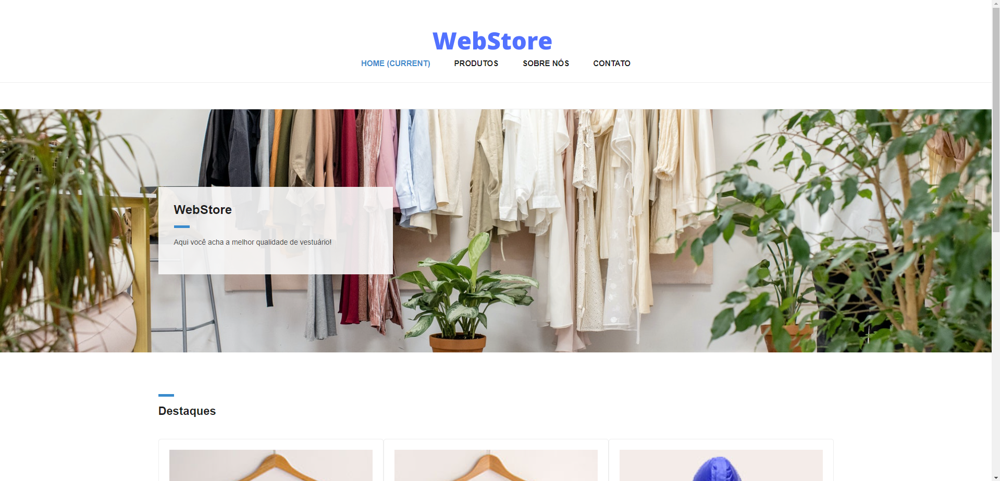

<h1 align="center"> Code Together WebStore JQuery </h1>

Projeto em andamento para base de conhecimento de JQuery e Bootstrap

Descrição da tarefa:

-Assista ao Code Together que se encontra no vídeo da nossa tarefa. Para melhor entendimento, pause o vídeo sempre que necessário para programar o código junto do professor. 
- Criar um projeto de e-commerce com o Bootstrap e JQuery seguindo com os módulos

<h2>🚀 Tecnologias utilizadas: </h2>

- HTML
- CSS
- JavaScript
- JQuery
- Bootstrap

<h2>📝 Licença</h2>
Esse projeto está sob a licença MIT. Veja o arquivo LICENSE para mais detalhes.
